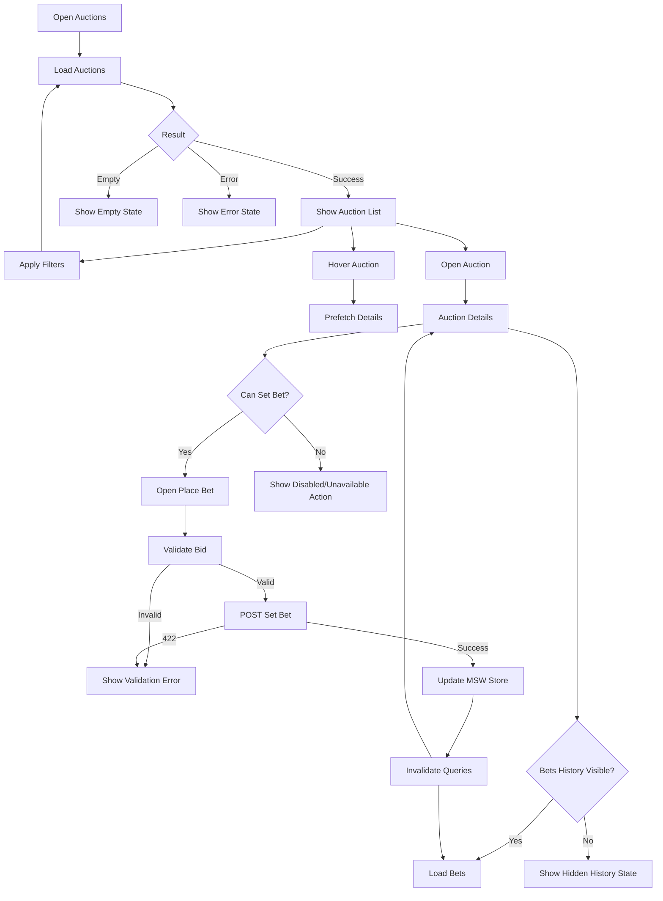

# Phase 0. Requirements Analysis

## 1. Purpose

This document defines the requirements, constraints, business scenarios, technical decisions, edge cases, and acceptance
criteria that must be understood before implementation starts.

The document is based on:

- the provided Frontend Developer test assignment;
- `openapi.auctions.v0.json`;
- the project constraint that the application must run in Docker.

The OpenAPI specification is treated as the source of truth for API contracts. The frontend implementation must not
invent or silently alter API structures, enum values, nullable fields, response formats, or error contracts.

---

# 2. Project Goal

Build a responsive SPA for working with cargo auctions.

The application must support:

1. viewing a paginated list of auctions;
2. filtering auctions;
3. opening an auction details page;
4. viewing the auction's bid history;
5. placing or changing a bid;
6. observing the changed state after a successful mutation.

The backend is not implemented. API behavior must be represented by MSW mocks that follow the OpenAPI contract and
maintain mutable state after mutations.

---

# 3. Mandatory Technology Stack

The assignment requires:

- React
- TypeScript
- Vite
- TanStack Router
- TanStack Query
- React Hook Form
- Zod
- MSW
- Feature-Sliced Design
- Zustand or MobX for focused client-side UI state

The project will use **Zustand** for client-side UI state.

The project will also use Docker as a mandatory development and verification environment.

---

# 4. Project Environment Constraint

## 4.1 Docker

The application must run inside a Docker container.

The host machine should not need a locally installed Node.js runtime to start the application.

Expected development flow:

```bash
docker compose up --build
```

The frontend development server must be exposed from the container to the host.

Expected local URL:

```text
http://localhost:5173
```

Docker setup must support:

- source-code mounting;
- dependency persistence;
- Vite hot reload;
- reproducible Node.js environment;
- straightforward project startup.

## 4.2 Docker Is Part of the Definition of Done

The implementation is not considered complete if the application works only through a host-installed Node.js
environment.

The final README must document the Docker-based startup procedure.

---

# 5. API Source of Truth

The OpenAPI document identifies the API as:

```text
API для UL - Auctions
version: 1.0.0
```

The declared server base path is:

```text
/api/v1/
```

The API exposes four operations required by the assignment.

---

# 6. Required API Operations

## 6.1 List Auctions

```http
POST /api/v1/auctions/list
```

Operation:

```text
listAuctions
```

Purpose:

Retrieve auctions using pagination and filters.

Possible responses defined by the contract:

- `200` — successful response;
- `401` — unauthorized;
- `422` — validation failure;
- `503` — service unavailable.

---

## 6.2 Get Auction Details

```http
GET /api/v1/auctions/{auctionUuid}
```

Operation:

```text
getAuction
```

Path parameter:

```text
auctionUuid
```

Format:

```text
uuid
```

Possible responses:

- `200` — successful response;
- `401` — unauthorized;
- `404` — auction not found;
- `503` — service unavailable.

---

## 6.3 Get Auction Bets

```http
GET /api/v1/auctions/{auctionUuid}/bets
```

Operation:

```text
listBets
```

Optional query parameter:

```text
all
```

Purpose:

When enabled, return all bets including cancelled bets.

Possible responses:

- `200` — successful response;
- `401` — unauthorized;
- `404` — auction not found;
- `503` — service unavailable.

---

## 6.4 Set Bet

```http
POST /api/v1/auctions/{auctionUuid}/bets
```

Operation:

```text
setBet
```

Request body:

```text
SetBetRequest
```

Required field:

```text
price
```

Possible responses:

- `200` — bet accepted;
- `401` — unauthorized;
- `404` — auction not found;
- `422` — validation failure;
- `503` — service unavailable.

---

# 7. Required Pages

The application must provide the following user-facing areas.

## 7.1 Auctions List

The list page must provide:

- auction loading through TanStack Query;
- pagination;
- skeleton state;
- empty state;
- error state;
- detail prefetch on user intent/hover;
- filters;
- filter persistence through URL search params or localStorage;
- Zod validation for search params;
- safe fallback values;
- desktop adaptation;
- mobile adaptation.

URL:

```text
/auctions
```

---

## 7.2 Auction Details

The details page must use:

```http
GET /auctions/{auctionUuid}
```

It must display:

- auction main information;
- organizer;
- contacts when they are not hidden;
- complete route;
- cargo;
- vehicle requirements;
- payment conditions;
- trading parameters;
- current price;
- available price;
- min/max/step;
- current user's bid state.

The UI must respect DTO restrictions:

- `can_set_bet`;
- `hide_bets_history`;
- `hide_points_address_and_contacts`;
- `no_view_cargo_price`.

URL:

```text
/auctions/:auctionUuid
```

---

## 7.3 Bets

The bets area must use:

```http
GET /auctions/{auctionUuid}/bets
```

It must display:

- list of bets;
- number of participants;
- price with VAT;
- price without VAT;
- carrier;
- ranking position;
- winner flag;
- cancelled/rejected state;
- cancellation/rejection reason when available;
- empty state;
- hidden-history state.

URL:

```text
/auctions/:auctionUuid/bets
```

The exact presentation can be implemented as a dedicated page or a section/tab associated with the auction details,
provided the required behavior remains directly accessible.

---

## 7.4 Place Bet

The place-bet mode must be accessible by a link.

URL:

```text
/auctions/:auctionUuid/place-bet
```

The form must use:

- React Hook Form;
- Zod.

The form must:

- be available only when `trading.can_set_bet` allows it;
- require a price;
- reject values less than or equal to zero;
- respect `min`, `max`, and `step` when supplied by the detail DTO;
- display the available price and bid step;
- submit through the set-bet mutation;
- display success/error feedback;
- process `422` validation errors.

---

# 8. Auction List Requirements

## 8.1 Auction Card

Each auction card must expose the information required by the assignment:

- request number;
- auction type;
- auction status;
- user's trading status;
- loading → unloading route;
- loading date;
- unloading date;
- cargo name;
- cargo weight;
- cargo volume;
- body type;
- current price;
- price per kilometer;
- bid step;
- whether the current user has a bid.

The primary action must adapt to the auction state and may be:

- `Сделать ставку`;
- `Изменить ставку`;
- `Смотреть ставки`;
- disabled state.

---

# 9. Required List Filters

The assignment explicitly requires at least:

```text
cargo_num
status
statuses
auc_type
load_city
unload_city
loading date from
loading date to
is_available
is_bidder
price from
price to
```

The OpenAPI request schema contains additional filters. Those will be analyzed in `api-analysis.md`.

Important distinction:

- assignment-required filters are mandatory for the UI;
- additional API-supported filters should not be exposed automatically unless they provide meaningful value and do not
  unnecessarily increase scope.

---

# 10. Search Params Strategy

The list filter state will be synchronized with URL search parameters.

Reasons:

- filters become shareable;
- browser Back/Forward works naturally;
- page state survives refresh;
- the URL describes the current list state;
- it avoids hiding important application state inside an opaque client store.

Zod will validate incoming search parameters.

Invalid values must never break the page.

Fallback strategy:

```text
invalid value
      ↓
Zod parsing
      ↓
safe fallback
      ↓
valid internal filter state
```

The URL parser must be treated as an untrusted input boundary.

---

# 11. Pagination

The OpenAPI contract defines pagination metadata including:

- `current_page`;
- `from`;
- `last_page`;
- `per_page`;
- `to`;
- `total`.

The list UI must use the server-provided pagination metadata rather than deriving page counts from the current array
length.

The pagination state must be coordinated with the URL filters.

Changing filters should reset the current page to the first page unless there is a deliberate reason not to.

---

# 12. Prefetch Strategy

The assignment requires detail prefetch based on user intent/hover.

Expected behavior:

```text
User points to auction
        ↓
hover / intent
        ↓
TanStack Query prefetch
        ↓
GET auction details
        ↓
navigation
        ↓
details available faster
```

Prefetch must not be triggered for every rendered card without user intent.

---

# 13. Auction Domain Concepts

The domain identified in the OpenAPI contract includes:

- auction;
- organizer;
- cargo;
- route;
- route point;
- trading;
- trading price;
- user's trading state;
- payment;
- bet;
- admitted organization;
- contacts;
- vehicle requirements;
- loading requirements;
- documents;
- assembly information.

These concepts should be represented as domain entities rather than flattened into unrelated UI state.

---

# 14. Important Enums

The API defines explicit string enums.

## AuctionType

```text
Request
Up
Down
FixPrice
Unknown
```

## AuctionStatus

```text
Planning
Auction
DeterminateWinner
WaitDeal
InProgress
Finished
Stopped
Canceled
Unknown
```

## TradingStatus

The API contains a trading-status enum including:

```text
NotParticipating
Leading
Losing
OnPending
Confirmed
ChoosingWinner
Winner
Accepted
Unknown
```

The application must not replace these contract values with arbitrary frontend-only strings.

Display labels can be localized separately from API values.

---

# 15. Nullable Data

The OpenAPI schema contains many explicitly nullable fields.

Examples include:

- organization site;
- subscriber role;
- infobase address;
- tax-related fields;
- route-related optional data;
- cargo characteristics;
- payment values;
- trading price values;
- user's last bid;
- contact information;
- trading settings.

Implementation rule:

```text
null ≠ undefined ≠ empty string ≠ zero ≠ false
```

The UI must distinguish meaningful values from absent values.

For example:

```text
price = 0
```

must not be treated as equivalent to:

```text
price = null
```

---

# 16. Price Handling

The OpenAPI contract contains multiple price representations.

The details DTO includes:

- start;
- start without VAT;
- current;
- current without VAT;
- available;
- available without VAT;
- min;
- min without VAT;
- max;
- max without VAT;
- step;
- step without VAT;
- price per kilometer.

The UI must not invent price calculations when the API already supplies the corresponding value.

The contract specifically describes `price_per_km` as:

```text
current_price_no_vat / distance
```

with `0` when distance is zero.

This is treated as an API contract detail rather than a reason to duplicate business calculations in unrelated UI
components.

---

# 17. Bid Validation

The API defines:

```text
SetBetRequest.price
```

as required and greater than zero.

Frontend validation must therefore guarantee at minimum:

```text
price > 0
```

When detail data contains:

```text
min
max
step
```

the UI must use them for validation and user guidance.

Validation must exist at two levels:

1. client-side Zod validation;
2. server-like MSW `422` validation behavior.

Client validation improves UX but does not replace server error handling.

---

# 18. MSW Requirements

MSW is not just a static response provider.

The mock implementation must maintain mutable application state.

Minimum mutable state:

```text
auction
 ├── current price
 ├── user trading status
 ├── user's current bid
 └── bets
```

After a successful mutation:

```text
POST /auctions/:uuid/bets
        ↓
validate request
        ↓
update MSW store
        ↓
update current price
        ↓
update user trading state
        ↓
append/update user's bet
        ↓
return successful response
```

This is important because the assignment explicitly requires the mock state to change after mutations.

---

# 19. Required Error Scenarios

The implementation must account for API-level errors defined by the OpenAPI contract.

## 401

Unauthorized.

UI should provide a controlled error state rather than crashing.

## 404

Resource not found.

Relevant for:

- auction details;
- bets;
- mutation.

The UI should provide a meaningful not-found state.

## 422

Validation failed.

Especially important for:

```text
POST /auctions/:auctionUuid/bets
```

Field-level validation errors must be mapped into the form where possible.

## 503

Service unavailable.

The UI should expose a recoverable error state.

---

# 20. Error Contract

The API defines `ProblemDetail` with:

```text
code
title
message
trace_id?
```

The implementation should preserve these values through the API layer.

`trace_id` is nullable and must not be assumed to exist.

Validation errors additionally use `ValidationError` information containing:

```text
field
message
```

Field paths use snake_case and nested fields are separated by dots.

---

# 21. UI State vs Server State

The project must keep server state and client UI state separate.

## TanStack Query

Use for:

- auctions list;
- auction details;
- bets;
- mutations;
- cache invalidation;
- prefetching;
- loading/error states.

## Zustand

Use only for focused client-side UI state, for example:

- UI preferences;
- temporary presentation state;
- mobile filter panel state;
- transient UI controls.

Do not duplicate TanStack Query server data inside Zustand.

---

# 22. Mutation Invalidation

After a successful bid mutation, the assignment explicitly requires invalidation of:

- list query;
- detail query;
- bets query.

Expected flow:

```text
place bid
   ↓
mutation succeeds
   ↓
MSW store changes
   ↓
invalidate auctions list
   ↓
invalidate auction detail
   ↓
invalidate auction bets
   ↓
UI reflects new state
```

This ensures that the application demonstrates real server-state synchronization rather than a local-only optimistic
illusion.

---

# 23. Routing Requirements

TanStack Router will own application routing.

Required routes:

```text
/auctions
/auctions/:auctionUuid
/auctions/:auctionUuid/bets
/auctions/:auctionUuid/place-bet
```

The exact route hierarchy can be refined during architecture design.

The place-bet mode must be reachable through a URL, not only through an in-memory modal state.

---

# 24. Responsive Requirements

The assignment explicitly requires desktop/mobile adaptation.

The UI must therefore be designed around content priorities rather than simply shrinking desktop layouts.

Desktop:

- multi-column information;
- full filter controls;
- rich auction cards.

Mobile:

- stacked information;
- compact cards;
- collapsible filters;
- touch-friendly actions;
- no horizontal overflow.

The final implementation must be manually checked at both viewport classes.

---

# 25. Component Naming Rule

The assignment contains an explicit instruction:

> all React component files must use the `*.component.tsx` suffix.

This is a mandatory project convention.

Examples:

```text
auction-card.component.tsx
auction-filters.component.tsx
auction-details.component.tsx
place-bet-form.component.tsx
```

Non-component files should not receive this suffix.

---

# 26. Feature-Sliced Design Constraint

The project will use Feature-Sliced Design.

Initial conceptual layers:

```text
app
pages
widgets
features
entities
shared
```

The exact folder tree will be defined in:

```text
docs/folder-structure.md
```

The architecture document will define dependency rules.

The main principle:

```text
higher layers may use lower layers;
lower layers must not depend on higher layers.
```

---

# 27. Testing Requirements

The assignment recommends minimal tests for pure logic.

At minimum, implement tests for:

- search params parsing;
- request builder;
- ViewModel mappers;
- bid validation schema.

Additional integration tests should cover critical user flows:

```text
list auctions
filter auctions
open details
view bets
place bid
observe changed state
```

The final README must state what was tested and what limitations remain.

---

# 28. Required Loading States

Every asynchronous screen must have an intentional loading state.

Minimum states:

```text
idle
loading
success
empty
error
```

For the auction list, skeleton loading is explicitly required.

For details and bets, skeletons or equivalent structured loading placeholders should be used to prevent layout jumps.

---

# 29. Required Empty States

The application must distinguish:

```text
No auctions found
```

from:

```text
Failed to load auctions
```

and:

```text
No bets found
```

from:

```text
Bet history is hidden
```

These are different business states and must not be represented by one generic empty component without context.

---

# 30. Business Constraints

The following DTO fields directly influence UI behavior.

## `can_set_bet`

Controls whether the bid action/form is available.

## `hide_bets_history`

Controls whether bid history can be displayed.

## `hide_points_address_and_contacts`

Controls visibility of sensitive route/contact information.

## `no_view_cargo_price`

Controls visibility of cargo price.

These are business constraints, not merely presentation flags.

---

# 31. Main User Flow



---

# 32. Critical Edge Cases

The implementation must explicitly consider:

### List

- empty response;
- invalid URL search params;
- page beyond available range;
- API validation error;
- unauthorized response;
- service unavailable;
- slow response;
- filter changes during loading.

### Details

- invalid UUID;
- nonexistent auction;
- hidden contacts;
- hidden route addresses;
- hidden cargo price;
- null price values;
- unavailable bid action;
- missing optional trading information.

### Bets

- no bets;
- hidden history;
- cancelled/rejected bets;
- missing cancellation reason;
- nullable transporter comment;
- nullable contact information.

### Place Bid

- empty price;
- zero price;
- negative price;
- below minimum;
- above maximum;
- incorrect step;
- server-side 422;
- auction no longer accepting bids;
- successful mutation followed by stale cached data.

---

# 33. Data Transformation Boundary

The API response must not be tightly coupled to UI rendering.

The preferred flow is:

```text
OpenAPI DTO
    ↓
API client
    ↓
query/mutation layer
    ↓
mapper / ViewModel
    ↓
domain-oriented UI model
    ↓
React components
```

This provides a clear boundary between:

- backend contract;
- application model;
- presentation model.

It also makes the recommended mapper tests meaningful.

---

# 34. Scope Control

The assignment does not require:

- real backend implementation;
- authentication implementation;
- production deployment;
- real external city service;
- real-time WebSocket updates;
- advanced analytics;
- complex user management.

These must not become hidden scope.

MSW is the backend substitute for this task.

The city selectors required by the assignment will use a mock city dictionary.

---

# 35. Documentation Requirements

The repository must contain:

```text
README.md
AI_USAGE.md
```

README must describe:

- project purpose;
- technology stack;
- architecture;
- Docker startup;
- local development;
- testing;
- scenarios checked;
- known limitations.

`AI_USAGE.md` must describe:

- which parts were created with AI;
- which decisions were made by the candidate;
- which AI suggestions were rejected;
- which areas received especially careful verification;
- remaining risks;
- what would be improved with one additional day.

---

# 36. Definition of Done

Phase 0 is complete when the following are documented and understood:

- [x] business goal;
- [x] mandatory technology stack;
- [x] required API operations;
- [x] required pages;
- [x] required filters;
- [x] auction card requirements;
- [x] details requirements;
- [x] bets requirements;
- [x] bid form requirements;
- [x] OpenAPI error scenarios;
- [x] nullable-data rules;
- [x] enum constraints;
- [x] MSW mutation requirements;
- [x] query invalidation requirements;
- [x] URL state strategy;
- [x] prefetch requirement;
- [x] responsive requirement;
- [x] component naming requirement;
- [x] testing scope;
- [x] Docker requirement;
- [x] documentation requirements;
- [x] edge cases;
- [x] definition of done.

---

# 37. Phase 0 Output

Phase 0 does not implement application code.

It produces the technical baseline required for the following phases:

```text
Phase 0
Requirements Analysis
        │
        ├── API contract
        ├── Business rules
        ├── User flows
        ├── Edge cases
        ├── State boundaries
        ├── Docker constraint
        └── Acceptance criteria
                │
                ▼
Phase 1+
Architecture and Implementation
```

The next document is:

```text
docs/api-analysis.md
```

It will contain the detailed OpenAPI analysis, including schemas, DTO relationships, enums, nullable fields,
request/response contracts, validation errors, pagination, and mutation behavior.
